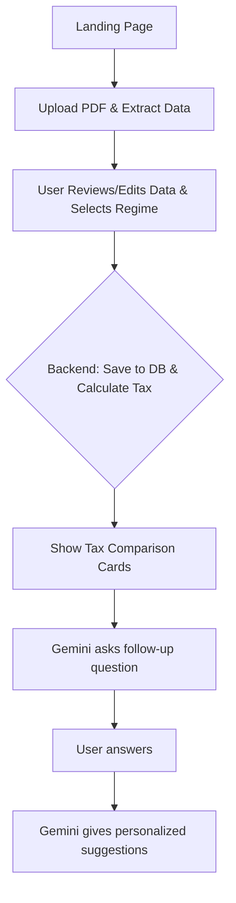

# Tax Advisor Application - Master PRD (V3)

## 1. Project Structure (MANDATORY)
All code and configuration files must reside in the project root, not inside a subfolder or virtual environment.

```
.env
app.py
requirements.txt
supabase_db_create.py
tax_calculator.py

/templates
    ask.html
    form.html
    index.html
    results.html

/uploads
```
- All Python code files are at the root.
- Templates and uploads are top-level folders.
- No code or user files inside the virtual environment directory.
- The virtual environment is for dependencies only. No project code, templates, or uploads should be placed inside it.

---

## 2. Overview
A web-based platform for salaried individuals to analyze tax liabilities and receive personalized, AI-powered tax-saving strategies. Users upload their salary slip or Form 16, review/enter data, compare tax regimes, and get actionable investment advice from Gemini.

---

## 3. Target Audience
- **Primary Users:** Salaried employees (India) with Pay Slips or Form 16.
- **Use Case:** Understand tax liabilities, optimize investments, and learn tax-saving techniques.

---

## 4. Core Features & User Flow

### Step 1: Landing Page
- Modern, branded landing page with a "Start" button to begin the process.
- **Integration:** `app.py` serves `/templates/index.html` directly from the root.

### Step 2: PDF Upload & Data Extraction
- User uploads a Pay Slip or Form 16 (PDF).
- The backend extracts data using `PyPDF2`, `pytesseract` (for OCR), and the `Gemini` LLM for structuring the data.
- The user is presented with a form pre-filled with the extracted data for review and editing.
- The user selects their preferred tax regime (Old/New) via a radio button.
- **Integration:** Frontend form in `/templates/form.html` posts to backend endpoint in `app.py`, which saves files to `/uploads`.

### Step 3: Tax Calculation & Comparison
- The backend calculates the tax liability for both regimes based on the verified data.
- Results are displayed in two visually distinct cards (Old vs. New Regime), with the user's selected regime highlighted.
- The financial data is saved to the Supabase database with a unique session ID.
- **Integration:** Tax calculation logic in `tax_calculator.py`, results rendered in `/templates/results.html`. Backend processes data and renders results template; frontend only handles form submission and result display.

### Step 4: AI-Powered Advisor (Gemini)
- Based on the user's data, Gemini proactively asks a smart, contextual follow-up question.
- After the user answers, Gemini provides personalized, actionable investment and tax-saving suggestions in a modern, readable card format.
- **Integration:** AI-powered advisor logic in `app.py` or a helper, results shown in `/templates/ask.html`. Frontend interacts with backend endpoints for AI Q&A, all logic in root-level Python files.

---

## 5. Unified Tech Stack
| Component         | Technology                                      |
|------------------|-------------------------------------------------|
| Frontend         | Vanilla HTML, CSS (Aptos Display font), JS      |
| Backend          | Python (FastAPI or Flask) in `app.py`           |
| Database         | Supabase (Cloud PostgreSQL, direct psycopg2)    |
| File Storage     | `/uploads` folder (temporary PDF storage)       |
| PDF Processing   | PyPDF2, pytesseract, pdf2image                  |
| AI/Conversational| Google Gemini Flash API                         |
| Deployment       | Render (from GitHub), `build.sh`                |

---

## 6. Data Model (Supabase)

### Table 1: `UserFinancials`
| Column Name           | Data Type         | Description                        |
|----------------------|-------------------|------------------------------------|
| session_id           | UUID              | Primary Key, unique session ID      |
| gross_salary         | NUMERIC(15, 2)    | Total gross salary                  |
| basic_salary         | NUMERIC(15, 2)    | Basic salary component              |
| hra_received         | NUMERIC(15, 2)    | HRA received                        |
| rent_paid            | NUMERIC(15, 2)    | Annual rent paid                    |
| deduction_80c        | NUMERIC(15, 2)    | 80C investments                     |
| deduction_80d        | NUMERIC(15, 2)    | 80D medical insurance               |
| standard_deduction   | NUMERIC(15, 2)    | Standard deduction                  |
| professional_tax     | NUMERIC(15, 2)    | Professional tax paid               |
| tds                  | NUMERIC(15, 2)    | Tax Deducted at Source              |
| created_at           | TIMESTAMPTZ       | Record creation timestamp           |

### Table 2: `TaxComparison`
Stores the results of tax calculations and AI advisor conversation logs for each session.

| Column Name           | Data Type         | Description                                        |
|----------------------|-------------------|----------------------------------------------------|
| session_id           | UUID              | Primary Key, links to UserFinancials                |
| tax_old_regime       | NUMERIC(15, 2)    | Calculated tax under Old Regime                     |
| tax_new_regime       | NUMERIC(15, 2)    | Calculated tax under New Regime                     |
| best_regime          | VARCHAR(10)       | Regime with lower tax ("old" or "new")              |
| selected_regime      | VARCHAR(10)       | Regime selected by the user                         |
| created_at           | TIMESTAMPTZ       | Record creation timestamp                           |

- The full conversation history with the AI advisor is stored in a separate file in the root folder named `ai_conversation_log.json`.
- This table enables tracking of both the tax comparison and the user's interaction with the AI advisor for each session.

---

## 7. UI/UX Principles
- Modern, light theme with blue highlights.
- Typography: Use the "Aptos Display" font for a distinct look.
- Multi-page Flow: A clear, step-by-step journey: Landing → Upload/Review → Tax Results → AI Suggestions.
- Responsive, accessible, and visually appealing design.

---

## 8. Security & Environment Variables
- Session-based data storage using UUIDs.
- No persistent file storage; PDFs are deleted from `/uploads` after processing.
- All secrets and credentials stored as environment variables in `.env` (not in code).
- HTTPS enforced in production.
- The virtual environment is for dependencies only. No project code, templates, or uploads should be placed inside it.
- **Only the following keys are required in `.env`:**
  - `GEMINI_API_KEY`
  - `DB_URL` (PostgreSQL URI, e.g. `postgresql://postgres:<password>@<host>:5432/postgres`)
- **Example .env file:**
  ```env
  GEMINI_API_KEY = "<your-gemini-api-key>"
  DB_URL = "postgresql://postgres:<password>@<host>:5432/postgres"
  ```
- The application must use `DB_URL` for all database operations. No other database connection methods or keys are required.

---

## 9. Development Stages & Milestones

### STAGE 1: Complete Local Development (with Supabase)
| Phase   | Deliverable/Feature                        | Acceptance Criteria                                                                                 |
|---------|--------------------------------------------|----------------------------------------------------------------------------------------------------|
| Phase 1 | Project setup, DB schema, landing page     | User sees the landing page (`/templates/index.html`), and the `UserFinancials` table exists.       |
|         | **Integration:** `app.py` serves landing page from root.                                                                       |
| Phase 2 | PDF upload, extraction, manual data review | User can upload a PDF and review/edit the auto-extracted data in a form.                           |
|         | **Integration:** `/templates/form.html` posts to backend in `app.py`, files saved to `/uploads`.                               |
| Phase 3 | Tax calculation engine, regime comparison  | User sees the tax comparison cards, and the data is saved to the database.                         |
|         | **Integration:** Tax logic in `tax_calculator.py`, results in `/templates/results.html`. Backend renders results.              |
| Phase 4 | Gemini-powered advisor (Q&A, suggestions)  | User receives a relevant follow-up question and then gets personalized AI suggestions.             |
|         | **Integration:** AI logic in `app.py` or helper, results in `/templates/ask.html`. Frontend interacts with backend endpoints.  |

### STAGE 2: Production Deployment (GitHub → Render)
| Phase   | Tasks                                      | Goal                                   |
|---------|--------------------------------------------|----------------------------------------|
| Phase 5 | GitHub Repository Setup & Code Push        | Version control established            |
| Phase 6 | Render Integration & Env Configuration     | Production environment setup           |
| Phase 7 | Production Testing & Optimization          | Verified production deployment         |
| Phase 8 | (Future) Session retrieval, admin analytics| User/admin can view past sessions      |

---

## 10. Deployment
- Use a `build.sh` script for Render deployment.
- The app must be runnable with `python app.py` from the root.
- All dependencies in `requirements.txt`.
- `.env` file in root for secrets/config.
- No code or uploads inside the virtual environment directory.
- **System dependencies for OCR:** The deployment environment must have Tesseract OCR installed for PDF data extraction. This is handled in the `build.sh` script below.
- Example `build.sh`:

```sh
#!/usr/bin/env bash
# exit on error
set -o errexit

# Install system dependencies for Tesseract OCR
apt-get update && apt-get install -y tesseract-ocr

# Install Python dependencies from requirements.txt
py -m pip install -r requirements.txt
```

---

## 11. Implementation Details
| Component         | Specification                                                      |
|------------------|--------------------------------------------------------------------|
| API Routes       | `/upload`, `/extract`, `/save`, `/calculate`, `/advisor`           |
| Env Variables    | All secrets in `.env` (never hardcoded)                            |
| DB Connection    | **All database operations must use the `DB_URL` from `.env`**      |
| GitHub Integration | Automatic deployment on push to the main branch                  |

---

## 12. Tax Calculation Logic (FY 2024-25)

### Old Tax Regime
- **Deductions:** Standard Deduction (₹50k), HRA, Professional Tax, 80C, 80D, etc.
- **Slabs:** 0% up to ₹2.5L, 5% up to ₹5L, 20% up to ₹10L, 30% above.

### New Tax Regime (Default)
- **Deductions:** Standard Deduction (₹50k) only.
- **Slabs:** 0% up to ₹3L, 5% up to ₹6L, 10% up to ₹9L, 15% up to ₹12L, 20% up to ₹15L, 30% above.
- *A 4% cess applies to the final tax amount in both regimes.*

---

## 13. Application Flow Diagram
